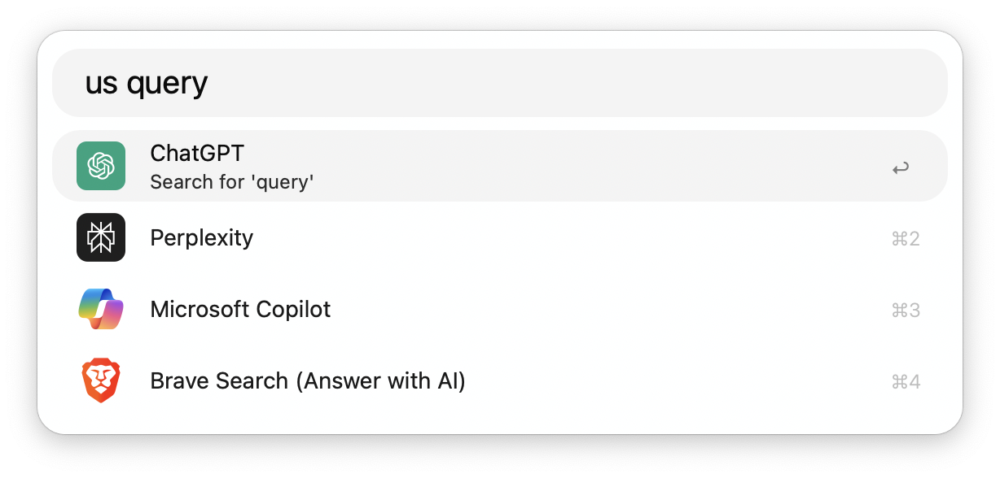
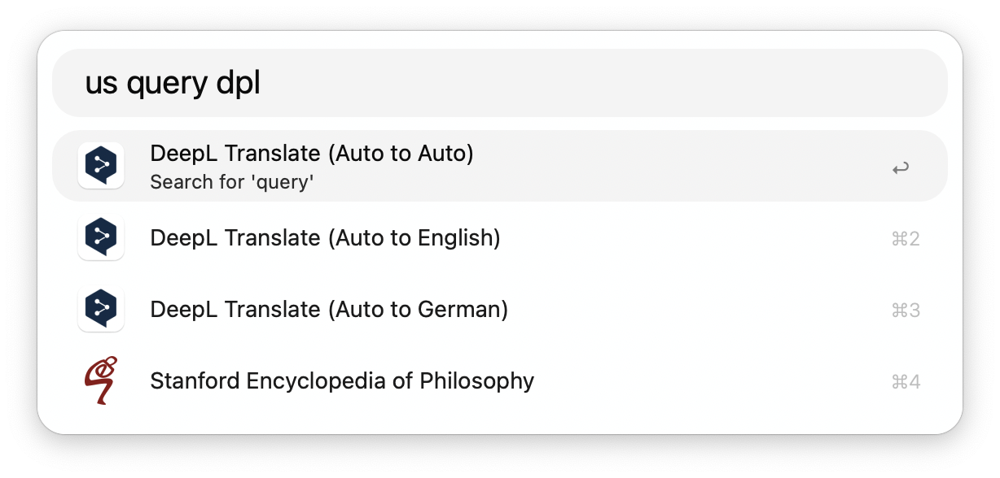
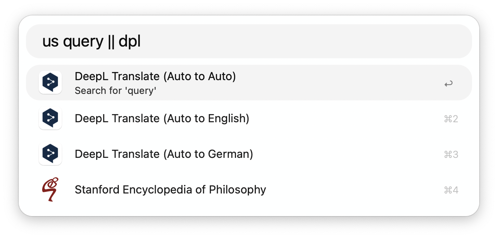
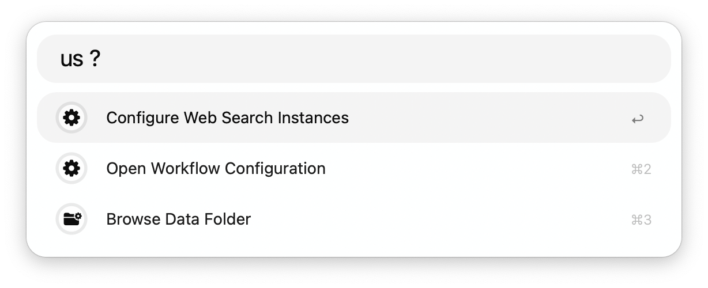
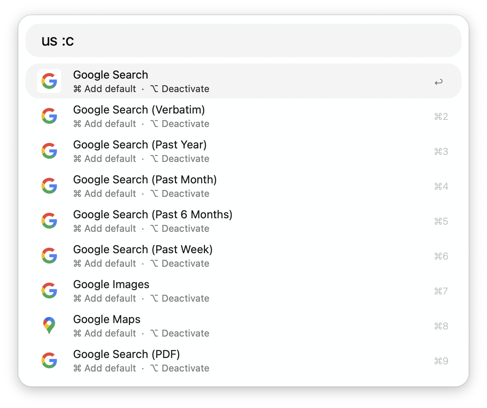
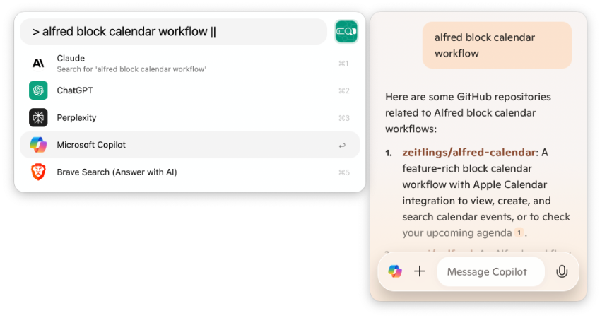

<h1> Unified Search</h1>
  

Unified Search is an [Alfred](https://www.alfredapp.com/) workflow that provides a unified search experience across multiple web search engines and websites, currently supporting 131 web search instances and extensible through Alfred's internal [custom web search](https://www.alfredapp.com/help/features/web-search/#custom) feature.

## Usage

### Unified Search

Query with available web searches via the `us` keyword, [Hotkey](https://www.alfredapp.com/help/workflows/triggers/hotkey/), [Universal Action](https://www.alfredapp.com/help/features/universal-actions/), or [Fallback Search](https://www.alfredapp.com/help/features/default-results/fallback-searches/). 

- <kbd>⇥</kbd> Enter explicit filter mode
- <kbd>⌥</kbd> View web search URL
- <kbd>⇧</kbd> View shorthand keyword (if available)

#### Explicit and Suffix Filtering

You can choose between two approaches that control the behavior of how the web search instances are filtered.

The explicit filter mode is always available by tapping <kbd>⇥</kbd>, but is optional when the behavior is set to __Filter Always__. This enables the suffix mode, which uses the last word of your query (the suffix) to try to find a matching web search instance. If a match is found, the suffix is removed from the query that will be sent to the website. 

If the behavior is set to __Filter on Tab__, it is mandatory to enter filter mode by tapping <kbd>⇥</kbd>, and only the default search instances will be displayed until you do.

__Note__: Typing `*` as wildcard suffix lists all available web searches.

### Extending the Web Searches

The most convenient way to include custom searches is to configure them using Alfred's internal [custom search](https://www.alfredapp.com/help/features/web-search/#custom) feature and enable integration with *Unified Search* in the [workflow's configuration](https://www.alfredapp.com/help/workflows/user-configuration/).

Alternatively, you can edit and customize `searches.config.pkl`, located in the workflow folder, and evaluate it to generate an updated version of `searches.json`, or edit this file directly. If you choose to do this, __be sure to back up your customizations before updating the workflow__ or your changes will be lost.

### Configuration

You can add specific web searches to the default options or remove them via the internal configuration. You can also activate or deactivate them entirely.

- <kbd>⌘</kbd><kbd>↩</kbd> Add to / Remove from defaults
- <kbd>⌥</kbd><kbd>↩</kbd> Activate / Deactivate web search

## Plugin: Extra Pane

You can use *Unified Search* with [Alfred Extra Pane](https://github.com/mr-pennyworth/alfred-extra-pane). 

Tap <kbd>⇥</kbd> while __in filter mode__ to elicit a preview, or prefix your search with `>` manually.  

<!-- Unified Search Extra Pane Plugin Preview -->

__Note:__ You can set the relevant [environment variable](https://www.alfredapp.com/help/workflows/advanced/variables/#environment) to `true` to always have the pane enabled.